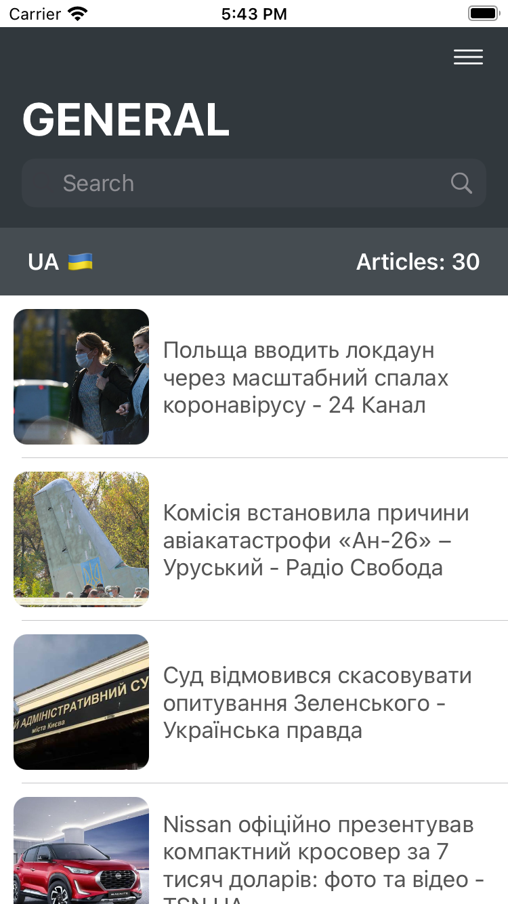
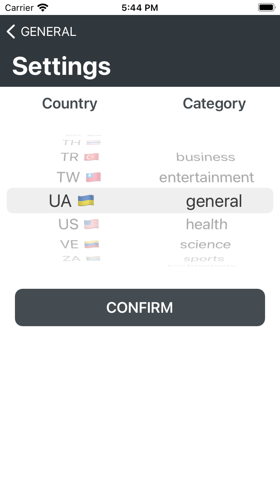

# News feed

App that shows the Current Breaking News Of The Day.

    
    
    
    

## Getting Started

    

Search worldwide news with code
Get breaking news headlines, and search for articles from news sources and blogs all over the web with our news API
You can get one here: [get News API](https://newsapi.org/docs).

# Installation
1. Install Cocoapods: sudo gem install cocoapods
2. Update pods in folder: pod update
3. Install [SDWebImage](https://github.com/SDWebImage/SDWebImage#installation)
4. Build project from Xcode.
